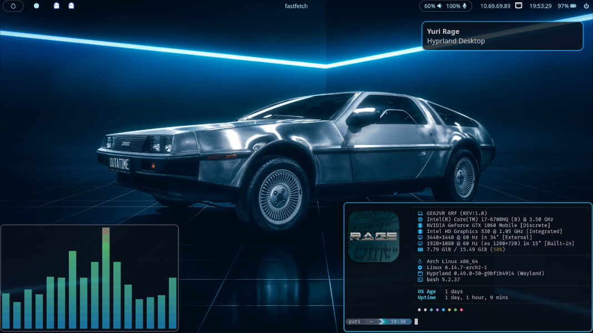

# Arch Hyprland Sync Headless Remote Branch

Adds [Sunshine](https://github.com/LizardByte/Sunshine) configuration for headless remote desktop. Uses greetd for tty autologin.

Linux config file sync via bash and [Gnu stow](https://www.gnu.org/software/stow/).



<sup>Original wallpaper artwork seems to originate [here](https://ray29rus.artstation.com/projects/dOQbgJ) but appears in multiple free-to-download wallpaper sites.<br>
This project is not licensed, as ThePrimeagen did not license the [repo that inspired it](https://github.com/ThePrimeagen/dev) but created video content showcasing its use as a tutorial.
</sup>

## Install

> **Prerequisites:**
> * Bootable Arch Linux installation
> * User with sudo privileges
> * git (installed with `sudo pacman -S git`)
> * If using a Proxmox host, use the VirGL GPU.
>   * If desired resolution is not available, try adding a line like `args: -device virtio-gpu-pci,xres=3440,yres=1440` to `/etc/pve/qemu-server/<vmid>.conf`.
>   * This should enable desired resolution to be used in a `monitor` line of `hyprland.conf`.

To get a minimally viable installation after `arch-chroot` and before rebooting:<br>
(skip to the next bash code block if configuring a pre-existing system)
```bash
pacman -S sudo git
useradd -m -G wheel -s /bin/bash yourname
passwd yourname
su yourname
sudo ls # to ensure sudo works
passwd -l root # if sudo works
```

Then issue the following:
```bash
cd ~
git clone https://www.github.com/yuri-rage/arch-hyprland-sync
cd arch-hyprland-sync
YURI_ENV="$PWD" ./run yay-install
YURI_ENV="$PWD" ./run stow-all
YURI_ENV="$PWD" ./run net-wifi-bluez-install # see "Services" below
exit   # the chroot session
reboot # you should be able to configure the rest after rebooting

```
> The `stow-all` script may result in a few errors regarding existing files. Move the offending files to a backup directory and re-run it. The sooner you execute the stow-all command on a newly configured system, the better, since most dotfiles won't yet exist, and you won't have to go to the trouble of moving them in bulk to a backup directory.

## Usage

The `scripts` directory contains install scripts for a fairly complete hyprland environment. To run a script, set the `YURI_ENV` environment variable to the cloned directory and use the `run` wrapper script. For example:

```bash
cd ~/arch-hyprland-sync
YURI_ENV="$PWD" ./run hyprland-install

```

You can use the the `--dry` flag to preview a script before running it like so:
```bash
cd ~/arch-hyprland-sync
YURI_ENV="$PWD" ./run hyprland-install --dry

```

To avoid having to set the `YURI_ENV` variable on each call to the `run` script, you can set the environment variable:
```bash
cd ~/arch-hyprland-sync
export YURI_ENV="$PWD"
```

Additional configuration files can be added in the `config` folder following the format of the existing ones. Any file added to an existing config or to a new config will by sync'd upon re-running the `stow-all` script.

To version control your own dotfiles, fork this repository and then push changes to dotfiles as desired. If `stow` is used properly, all edits will remain within the cloned directory, so pushing upstream should be as simple as editing, committing, and pushing to origin.

## Services

You may have to manually enable services such as:
```bash
sudo systemctl enable --now NetworkManager
sudo systemctl enable --now greetd
systemctl --user enable --now hyprpaper hyprpolkitagent waybar
systemctl --user enable --now sunshine.service
# and to automount the smb share with gvfs
systemctl --user enable --now mount-smb
# and finally, to ensure auto-login works
loginctl enable-linger $USER
```

## Sunshine/Moonlight Remote Desktop

Start `sunshine` via the command line, and visit the web interface to create a username/password for your system. Then pair the Moonlight client by entering its PIN number.

## NeoVim

After completing installation/configuration, use `:Mason` from within NeoVim to install the language servers, linters, and formatters required by `lsp-config.lua` and `none-ls.lua`.

## Notes

If using the systemd `mount-smb` service to mount an smb share upon login, it expects a 3 line file called `~/.local/share/smb/smbcredentials` with the format:
```
username
WORKGROUP
password
```
Yes, the password is stored in the clear, so do not connect to a share whose security is critical. There's probably a much better way to do this. I don't know it.

